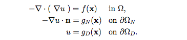
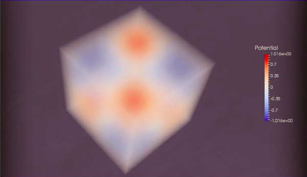

# Large Scale Distributed Poisson Equation Solver

## Introduction
This code is designed to numerically solve the <a href="https://en.wikipedia.org/wiki/Poisson's_equation">Poisson equation</a>,

in 2D and 3D using the <a href="http://www.sciencedirect.com/science/article/pii/S0168927406000651">local discontinuous Galerkin (LDG) method</a> from scratch. 

## Why I Wrote This
The tutorial codes in the <a href="http://dealii.org/">deal.ii library</a> (step-12 and step-39) use the MeshWorker interface to build discontinuous Galerkin (DG) methods. While this is very convenient, I could not use this framework for solving my research roblem and I needed write the LDG method from scratch. I thought it would help for others to have access to this example that goes through writing a discontinuous Galerkin method from scatch and also shows how to do it in a distributed setting using the <a href="https://www.trilinos.org">Trilinos</a> library. Therefore, I submitted this code to the <a href="http://dealii.org/code-gallery.html">deal.II code-gallery</a>. This example may also be of interest to users that wish to use the LDG method, as the method is distinctly different from the <a href="http://www3.nd.edu/~zxu2/acms60790S14/unified-analy-dg-elliptic-eq.pdf">Interior Penalty Discontinuous Galerkin (IPDG)</a> methods and was not covered in other tutorials on DG methods.  

## Why Local Discontinuous Galerkin Methods?
The LDG method is very useful when one is working with a differential equation and desires both approximations to the scalar unknown function as well as its flux. The mixed method is another method where one can obtain both the scalar unknown function as we as its flux, however, the LDG method has less unknowns to solve for then the <a href="https://en.wikipedia.org/wiki/Mixed_finite_element_method">
mixed finite element method</a> and using the <a href="https://en.wikipedia.org/wiki/Raviart%E2%80%93Thomas_basis_functions">Raviart-Thomas elements</a>. The LDG method also approximates the scalar unknown function and its flux using discontinous polynomial basis function. This makes it much more suitable when one wishes to use local mesh refinement as <a href="http://scicomp.stackexchange.com/questions/21372/what-is-a-hanging-node-in-the-finite-element-meshing">hanging nodes</a> are not an issue as they are in the mixed method or other finite element methods. For an introduction do the LDG method, see the write-up <a href="doc/intro.pdf"> here</a>.

## Requirements
The requirements for this software are,
1. <a href="https://www.dealii.org">deal.ii library</a> version 8.3.0 or higher,
2. <a href="https://www.cmake.org">CMake</a> version 2.8 or higher,
3. <a href="https://www.mpich.org">MPI</a> version 2/3.1.4,
4. <a href="https://www.trilinos.org">Trilinos<a/> version 11.12,
5. <a href="http://www.p4est.org">p4est<a/> version 1.1,
6. <a href="http://www.paraview.org/">ParaView</a> for visualization.

## Installation
First obtain and install a copy of the dealii
<a href="https://www.dealii.org">deal.ii library</a> version 8.3.0 or higher as well as the other dependencies.
See the dealii library for installation <a href="http://dealii.org/8.4.1/index.html">instructions</a> and installation instructions for Trilinos and p4est.

## Compiling
To generate a makefile for this code using CMake, type the following command into the terminal from the main directory:

	cmake . -DDEAL_II_DIR=/path_to_deal.ii

To compile the code in debug mode use:

	make

To compile the code in release mode use:

	make release	

Either of these commands will create the executable, <code>main</code>, however the release mode will make a faster executable.

## Using the code
To run the code on <code>N</code> processor type the following command into ther terminal from the main directory,

	mpirun -np N ./main

The output of the code will be <code>.vtu</code> and <code>.pvtu</code> and be written to disk in parallel.  The results can be viewed using <a href="http://www.paraview.org/">ParaView</a>.  An example of the results for a 3D problem are shown below,

